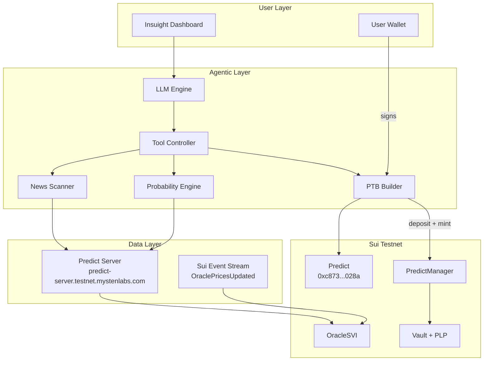
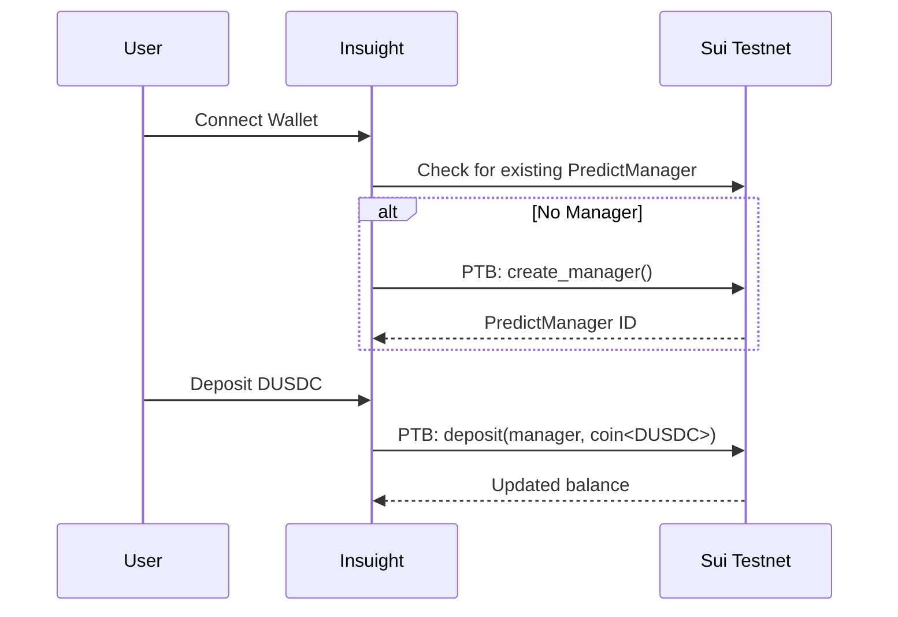
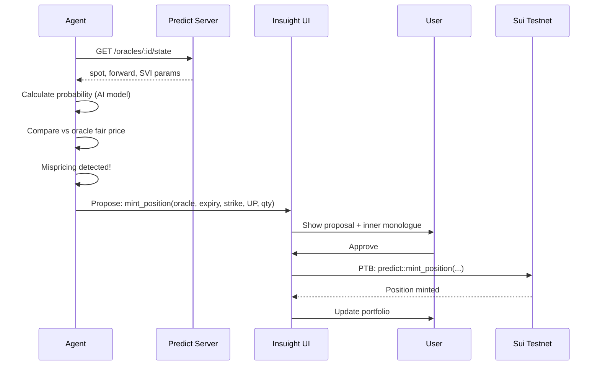

# Insuight Architecture: Technical Specification

## 1. System Overview



## 2. Contract Constants (Testnet)

| Name | Value |
|------|-------|
| **Predict Package** | `0xf5ea2b3749c65d6e56507cc35388719aadb28f9cab873696a2f8687f5c785138` |
| **Predict Object** | `0xc8736204d12f0a7277c86388a68bf8a194b0a14c5538ad13f22cbd8e2a38028a` |
| **Registry Object** | `0x43af14fed5480c20ff77e2263d5f794c35b9fab7e2212903127062f4fe2a6e64` |
| **DUSDC Type** | `0xe95040085976bfd54a1a07225cd46c8a2b4e8e2b6732f140a0fc49850ba73e1a::dusdc::DUSDC` |
| **DUSDC Metadata** | `0xf3000dff421833d4bb8ed58fac146d691a3aaba2785aa1989af65a7089ca3e9c` |
| **PLP Type** | `0xf5ea2b3749c65d6e56507cc35388719aadb28f9cab873696a2f8687f5c785138::plp::PLP` |
| **Predict Server** | `https://predict-server.testnet.mystenlabs.com` |
| **Source Branch** | `predict-testnet-4-16` |

## 3. Predict Server API Reference

### 3.1 Protocol & Market State
```
GET /status                              → Server health
GET /predicts/:predict_id/state          → Market state
GET /predicts/:predict_id/oracles        → Active oracles
GET /oracles/:oracle_id/state            → Oracle pricing (spot, forward, SVI)
GET /predicts/:predict_id/quote-assets   → Accepted quote assets
GET /oracles/:oracle_id/ask-bounds       → Strike price bounds
```

### 3.2 Vault & LP Data
```
GET /predicts/:predict_id/vault/summary           → Vault TVL, PLP supply
GET /predicts/:predict_id/vault/performance?range=ALL → Vault performance
GET /lp/supplies                                   → LP supply history
GET /lp/withdrawals                                → LP withdrawal history
```

### 3.3 Manager & Portfolio
```
GET /managers                             → All managers
GET /managers/:manager_id/summary         → Manager balances
GET /managers/:manager_id/positions/summary → Open positions
GET /managers/:manager_id/pnl?range=ALL   → PnL history
```

### 3.4 History
```
GET /oracles/:oracle_id/prices            → Price history
GET /oracles/:oracle_id/prices/latest     → Latest price
GET /oracles/:oracle_id/svi               → SVI parameter history
GET /oracles/:oracle_id/svi/latest        → Latest SVI
GET /positions/minted                     → Minted positions
GET /positions/redeemed                   → Redeemed positions
GET /ranges/minted                        → Minted ranges
GET /ranges/redeemed                      → Redeemed ranges
GET /trades/:oracle_id                    → Trade history
```

### 3.5 Live Events (WebSocket/Checkpoint)
```
oracle::OraclePricesUpdated  → Spot/forward price update
oracle::OracleSVIUpdated     → SVI surface parameter update
oracle::OracleSettled        → Oracle reached settlement
oracle::OracleActivated      → New oracle activated
```

## 4. On-Chain Interaction Model

### 4.1 PredictManager Lifecycle


### 4.2 Binary Position Minting (Agent-Proposed)


### 4.3 Key PTB Functions
```
predict::create_manager()                          → Create PredictManager
predict::deposit<DUSDC>(manager, coin)             → Deposit quote asset
predict::withdraw<DUSDC>(manager, amount)           → Withdraw quote asset
predict::mint_position(predict, manager, oracle, ...) → Mint binary position
predict::redeem_position(predict, manager, oracle, ...) → Redeem position
predict::mint_range(predict, manager, oracle, ...)    → Mint vertical range
predict::redeem_range(predict, manager, oracle, ...)  → Redeem range
predict::supply<DUSDC>(predict, manager, coin)       → Supply to vault (LP)
predict::withdraw_lp<DUSDC>(predict, manager, amount) → Withdraw from vault
```

## 5. Agent Architecture

### 5.1 Tool Definitions
```typescript
const AGENT_TOOLS = [
  {
    name: "getActiveOracles",
    description: "Fetch all active oracles with their pricing data",
    // Calls: GET /predicts/:id/oracles + GET /oracles/:id/state
  },
  {
    name: "analyzeEvent",
    description: "Research a real-world event and estimate binary probability",
    // Uses: LLM reasoning + news API data
  },
  {
    name: "detectMispricing",
    description: "Compare AI probability vs oracle fair price, flag if divergence > threshold",
    // Uses: Oracle state + AI probability
  },
  {
    name: "proposeMintPosition",
    description: "Build a PTB to mint a binary position for user approval",
    // Builds: predict::mint_position PTB
  },
  {
    name: "getPortfolio",
    description: "Fetch user's current positions and PnL",
    // Calls: GET /managers/:id/positions/summary
  }
];
```

### 5.2 Agent Loop
```
while (active) {
  1. Fetch active oracles
  2. For each oracle:
     a. Identify the underlying event
     b. Research via news/data
     c. Estimate probability
     d. Compare vs oracle price
     e. If mispricing > threshold → propose trade
  3. Check existing positions for settlement opportunities
  4. Log all reasoning to Inner Monologue
  5. Wait for next cycle
}
```

## 6. Frontend Component Tree
```
<App>
  <Navbar />                    ← Brand + Wallet Connect
  <Routes>
    <PredictDashboard />        ← Market overview
      <MarketCard />            ← Individual oracle/market
    <AgentConsole />            ← Agent monologue + proposals
      <TradeProposal />        ← Approve/reject agent trade
    <PortfolioView />           ← Positions, PnL, vault
      <PositionCard />         ← Individual position
  </Routes>
</App>
```

## 7. Security Model

| Concern | Mitigation |
|---------|-----------|
| Agent overspending | User-defined per-trade and daily spending caps |
| Malicious trade proposal | All PTBs dry-run before presenting to user |
| Private key exposure | Agent never accesses keys — wallet signs externally |
| Stale oracle data | Always read on-chain state before wallet flows |
| Server downtime | Graceful fallback to direct on-chain reads |

## 8. Prediction Market Pool System

See detailed doc → **[prediction_market_backend.md](./prediction_market_backend.md)**

### Quick Reference — Custom Market Flow

```
deploy YES + NO coins
        ↓
create_market(description, yes_treasury, no_treasury)
        ↓                              ↓
   Market (shared)              AdminCap (deployer)
        ↓
user: mint(market, SUI) → Coin<YES> + Coin<NO>
        ↓                         ↓
   keep one side           sell other on DeepBook V3
        ↓
admin: resolve(market, cap, winner=1|2)
        ↓
winner: claim_yes() / claim_no() → SUI payout
```

### Quick Reference — Agent Vault Flow

```
user: create_vault(agent_address, policy)
        ↓
user: deposit(vault, DUSDC)
        ↓
agent: execute_agent_trade(vault, oracle_params)
  → on-chain signal computed (momentum 60% + reversion 40%)
  → policy guardrails checked (size, daily limit, edge, direction)
  → funds withdrawn + events emitted
  → DUSDC transferred to owner for PTB composition with predict::mint_position
        ↓
user: withdraw() / revoke_agent()  ← always available
```
