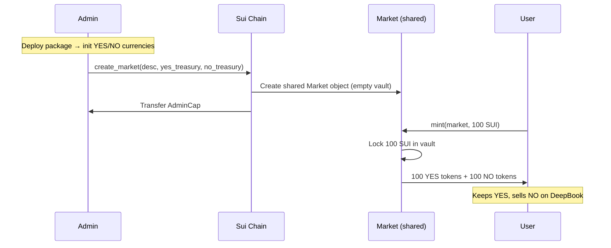
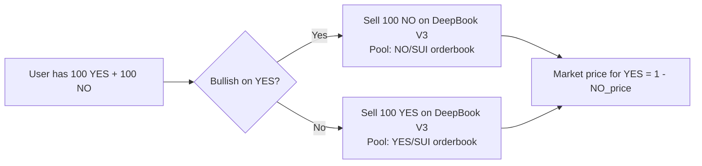
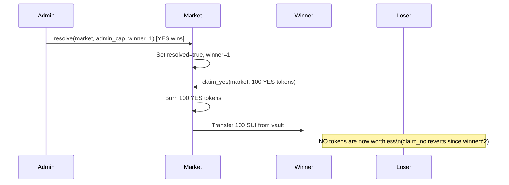
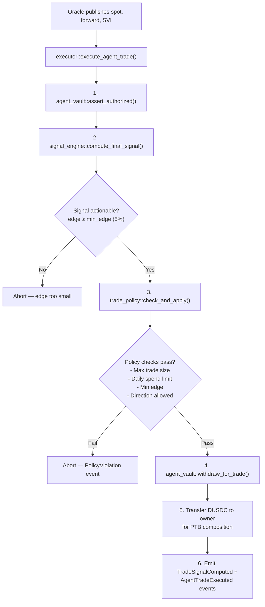

# Backend Integration Plan: Prediction Market Pools, YES/NO Trading & Resolution

> Last updated: 2026-05-29  
> Status: Awaiting deployment decisions (see Open Questions)

**Related docs:**
- [prediction_market_backend.md](./prediction_market_backend.md) — Full on-chain mechanics reference
- [resolution_sources.md](./resolution_sources.md) — Where each category gets its outcome data
- [architecture.md](./architecture.md) — Full system architecture
- [onchain_implementation.md](./onchain_implementation.md) — Agent vault & executor design

---

## System Architecture Overview

You have **two on-chain systems** working together:

### System 1 — Custom Prediction Market (`contracts/predict/`)
Simple, self-contained YES/NO binary market. Like a mini Polymarket.

| Contract | Purpose |
|----------|---------|
| `contracts/predict/sources/market.move` | Pool creation, collateral vault, minting, resolution, claiming |
| `contracts/predict/sources/yes.move` | YES outcome token (`Coin<YES>`, 9 decimals) |
| `contracts/predict/sources/no.move` | NO outcome token (`Coin<NO>`, 9 decimals) |

### System 2 — Insuight Agent System (`contracts/insuight/`)
Autonomous AI trading agent that integrates with **DeepBook Predict** (MystenLabs' official prediction market infra on testnet).

| Contract | Purpose |
|----------|---------|
| `contracts/insuight/sources/signal_engine.move` | On-chain "AI brain" — momentum (60%) + reversion (40%) ensemble |
| `contracts/insuight/sources/agent_vault.move` | Non-custodial user vault — holds DUSDC, users control deposit/withdraw |
| `contracts/insuight/sources/executor.move` | Trade orchestrator — authorize → compute signal → validate policy → withdraw → emit events |
| `contracts/insuight/sources/trade_policy.move` | Risk guardrails (max trade size, daily spend limit, min edge, direction lock) |
| `contracts/insuight/sources/events.move` | Full audit trail — `VaultCreated`, `TradeSignalComputed`, `AgentTradeExecuted`, etc. |

---

## How the Pool / YES-NO Flow Works End to End

### Flow 1: Pool Creation & Minting



**What happens on-chain in `mint()`:**
```
1. Assert market is NOT resolved
2. Lock the user's SUI payment into market.vault (Balance<SUI>)
3. Mint equal YES tokens from yes_treasury (amount = SUI deposited)
4. Mint equal NO tokens from no_treasury (amount = SUI deposited)
5. Return (Coin<YES>, Coin<NO>) to the user
```

### Flow 2: Price Discovery via Trading



### Flow 3: Resolution & Claiming



### Flow 4: Agent Autonomous Trading (Insuight System)



---

## Signal Engine — How the AI Decides

The on-chain algorithm computes a **conviction score** (5%–95%) for UP or DOWN:

| Component | Weight | Logic |
|-----------|--------|-------|
| **Momentum** | 60% | `premium = \|forward - spot\| / spot` → high forward premium = bullish. Dampened by volatility (σ) |
| **Reversion** | 40% | Distance from strike price → if price far above strike, expect pullback. Only activates when deviation > 3% |

**Ensemble rules:**
- Both agree → weighted average (60/40)
- They disagree → use the stronger signal's direction, penalised toward 50%
- **Edge** = `|conviction - oracle_implied_probability|`
- **Actionable** = edge ≥ user's `min_edge_bps` (default 5%)

---

## Planned Frontend Integration

### New Files to Create

#### `src/services/marketTransactions.ts`
Builds Sui Programmable Transaction Blocks for every action:

```typescript
// Pool creation
buildCreateMarketTx(description, yesTreasuryId, noTreasuryId) → Transaction

// Minting shares (user locks SUI → gets YES + NO)
buildMintSharesTx(marketId, suiAmount) → Transaction

// Resolution (admin only)
buildResolveTx(marketId, adminCapId, winner: 1 | 2) → Transaction

// Claiming winnings
buildClaimYesTx(marketId, yesTokenId) → Transaction
buildClaimNoTx(marketId, noTokenId) → Transaction
```

#### `src/hooks/useMarketActions.ts`
Wraps transaction builders with `useSignAndExecuteTransaction` from `@mysten/dapp-kit`:

```typescript
useCreateMarket()   → { create, isPending, error }
useMintShares()     → { mint, isPending, error, txDigest }
useResolveMarket()  → { resolve, isPending, error }
useClaimWinnings()  → { claim, isPending, error, txDigest }
```

#### `src/components/TradeModal.tsx`
Professional modal for placing predictions:
- Market question display
- SUI amount input with wallet balance shown
- "Buy Yes" / "Buy No" toggle
- Live price preview (you'll receive X YES + X NO)
- Sign & Execute button → shows transaction status
- Success state with Sui Explorer link

#### `src/components/CreateMarketModal.tsx`
Admin interface to create new prediction pools:
- Market question/description field
- Category selector
- Treasury Cap ID inputs (YES + NO)
- AI Signal preview (runs prediction algorithm on current oracle data)
- Create button → builds and signs the PTB

### Modified Files

#### `src/components/PredictDashboard.tsx`
- Wire "Yes" / "No" card buttons → open `TradeModal`
- Wire "+ Create Market" header button → open `CreateMarketModal`
- Show transaction status toasts

---

## Open Questions

### 1. Contract Deployment
Both packages show `"0x0"` addresses (undeployed):
- `contracts/predict/Move.toml` → `predict = "0x0"`
- `contracts/insuight/Move.toml` → `insuight = "0x0"`

The DeepBook Predict server (MystenLabs) is already live on testnet at the `PREDICT_PACKAGE` address in `constants.ts`. Options:

| Option | Description |
|--------|-------------|
| **(A)** DeepBook Predict only | Wire frontend to the existing live API — mint positions via their oracles |
| **(B)** Custom market only | Deploy `predict` package first via `sui client publish`, then wire frontend |
| **(C)** Both | DeepBook Predict for live oracle data, custom market for own pools |

### 2. Multi-Market Support
`yes.move` and `no.move` transfer `TreasuryCap` to the deployer at init, and `create_market()` consumes both TreasuryCaps — meaning **each package deployment = 1 market only**.

| Option | Description |
|--------|-------------|
| **(A)** Keep current design | One market per deployment — simple, ship fast |
| **(B)** Factory pattern | Refactor contracts to support multiple markets with generic coin types |

### 3. DeepBook V3 Orderbook Trading
`tx-builder.ts` shows selling NO tokens on a DeepBook pool, but no YES/SUI or NO/SUI pool exists yet.

| Option | Description |
|--------|-------------|
| **(A)** Skip for now | Users mint YES+NO and hold until resolution — no orderbook needed |
| **(B)** Create pools | Create DeepBook V3 pools for YES/SUI and NO/SUI, integrate limit orders |

---

## Deployment Checklist

```bash
# 1. Publish the predict package
sui client publish contracts/predict/ --gas-budget 100000000

# 2. Note published IDs from output:
#    - Package ID        → update PACKAGE_ID in scripts/
#    - YES TreasuryCap   → needed for create_market tx
#    - NO TreasuryCap    → needed for create_market tx

# 3. Create the market on-chain (call create_market PTB)

# 4. (Optional) Create DeepBook V3 pools for YES/SUI and NO/SUI

# 5. Publish the insuight package
sui client publish contracts/insuight/ --gas-budget 100000000
```

---

## Verification Plan

### Automated Tests
- `npx tsc --noEmit` — TypeScript compilation
- `npx vite build` — Full production build
- Transaction builders return valid `Transaction` objects

### Manual Verification
- Connect Sui wallet on testnet
- Open Trade Modal → verify UI is correct
- Preview transaction → verify PTB structure matches contract ABI
- Full cycle test (mint → hold → resolve → claim) once contracts are deployed
