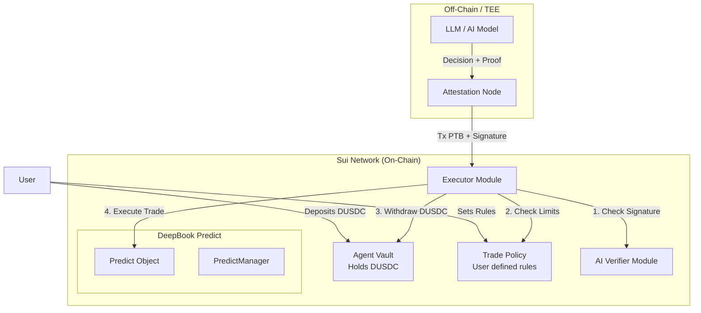

# On-Chain Implementation Architecture

This document details the transition from an off-chain LLM agent to a decentralized, Sui-native on-chain AI agent model using Move. This architecture enables verifiable, trustless trade execution on DeepBook Predict.

## 1. On-Chain AI Agent Paradigm

To remove the centralized reliance on an off-chain OpenRouter/LLM service for execution, the agent's logic is encapsulated within a Move smart contract. Since LLMs cannot natively run inside a Move execution environment (yet), the architecture uses an **Oracle-Verifier pattern** or a **TEE (Trusted Execution Environment)** combined with Move to ensure trades are trustless.

### Core Move Modules
The on-chain package (`insuight_agent::...`) will consist of the following core modules:

- `agent_vault`: Manages user funds deposited for agent execution.
- `trade_policy`: Defines user-configurable risk parameters (max trade size, allowed markets, stop-loss).
- `verifier`: Validates cryptographic proofs or signatures from the off-chain AI model, proving the LLM output was generated faithfully.
- `executor`: The central routing module that interacts with DeepBook Predict to mint or redeem binary positions.

## 2. Smart Contract Architecture



## 3. Key Move Structs

### 3.1 `AgentManager`
The central object representing the user's delegated AI trading account.
```move
struct AgentManager has key, store {
    id: UID,
    owner: address,
    /// Balance of DUSDC allocated to the agent
    balance: Balance<DUSDC>,
    /// Address of the authorized AI oracle or TEE
    authorized_signer: address,
    /// User-defined policies
    max_trade_size: u64,
    daily_spend_limit: u64,
    spend_today: u64,
    last_reset_epoch: u64,
}
```

### 3.2 `TradeProposal`
Represents the AI's intent, packaged as a payload to be signed and verified.
```move
struct TradeProposal has copy, drop {
    oracle_id: ID,
    direction: u8, // 0 for DOWN, 1 for UP
    quantity: u64,
    timestamp: u64,
}
```

## 4. Execution Workflow

1. **Off-Chain Analysis**: The AI model analyzes news and DeepBook Predict oracle data. It identifies a mispricing (e.g., implied probability is 40%, but AI confidence is 75%).
2. **Attestation**: The AI environment (preferably a TEE like Intel SGX or AWS Nitro Enclaves) generates the `TradeProposal` and signs it using a private key whose public key is registered in the `AgentManager`.
3. **PTB Submission**: A relayer (or the user's frontend in "semi-autonomous" mode) submits a Programmable Transaction Block (PTB) containing the signed proposal.
4. **On-Chain Verification**: 
   - `verifier::verify_signature` checks the TEE signature.
   - `trade_policy::check_limits` ensures the trade doesn't violate the user's max trade size or daily spend limit.
5. **Trade Execution**: `executor::execute_trade` calls `predict::mint_position` on DeepBook Predict, passing the required DUSDC from the `AgentManager`'s balance.

## 5. Security & Trustlessness

- **Non-Custodial**: The AI never holds the user's private keys. It only holds a restricted signing key that the `AgentManager` smart contract respects *strictly* within the bounds of the `TradePolicy`.
- **Revocability**: The user can call `agent::revoke_signer` at any time, instantly stripping the AI of its trading privileges.
- **Verifiable AI**: By using TEEs or emerging ZK-ML networks, the `verifier` module ensures the trade signal definitively came from the agreed-upon model and prompt, mitigating prompt injection or man-in-the-middle attacks.

## 6. Development Phases

**Phase 1: Multi-Sig "Semi-Autonomous"**
- The AI runs entirely off-chain and constructs PTBs.
- The UI presents the PTB to the user.
- The user signs the PTB with their wallet. No Move agent contracts required yet. (Currently implemented)

**Phase 2: Oracle-Delegated Agent**
- Implement `AgentManager` Move contract.
- User deposits DUSDC into the contract and authorizes the backend AI's public key.
- The backend AI submits trades automatically, bounded by the smart contract's `trade_policy`.

**Phase 3: Fully Trustless TEE/ZK Agent**
- Move the AI execution into a verifiable enclave.
- The Move contract verifies the enclave's remote attestation proof before executing any trades, ensuring the AI model code was not tampered with.
